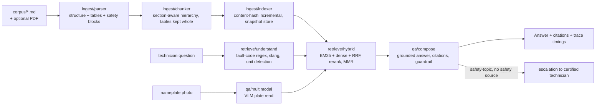

# HVAC-Copilot

**Multimodal document processor → grounded RAG assistant for HVAC field technicians.**

---

## 🟢 New to AI? Read this first

**The problem, in human terms.** An air-conditioning technician is on a rooftop, staring at a heat pump flashing error code "E04". The repair manual is a 300-page PDF in the van. Googling the code gets forum guesses — for equipment that can electrocute you or vent refrigerant into the sky.

**What this project does.** HVAC-Copilot turns the manuals into a question-answerer the tech can use mid-job:

- **Type the code, get the row.** Ask "what does fault code E04 mean on the X200?" and the exact table row from the manual comes back — *symptom, likely cause, corrective action, severity* — quoted, not paraphrased. Exact-code lookups are rendered deterministically; the AI never rewords a fault table.
- **Speak technician.** "Not cooling", "it's tripping", "the coil is icing" are translated into the manual's vocabulary before searching (slang normalization), and the answer always carries **citations**: which document, which section, down to the character span.
- **It refuses when it should.** Questions about refrigerant recovery, live electrical work, or pressurized systems are *safety-critical*. If the manual's safety chapter actually covers the procedure, the assistant cites it. If it doesn't, the assistant **refuses to give procedural guidance and escalates to a certified technician** — with the nearest safety section named. A guardrail that fired on "how much refrigerant does the unit carry?" (a spec lookup) would train users to ignore it, so quantity questions are deliberately exempt.
- **Photos, too.** A nameplate photo goes to a vision model to identify the unit, then retrieval targets that unit's manual (the offline mock demonstrates the flow; a real VLM plugs in via one env var).

**Measured outcomes:** 19 automated tests pass offline over a committed 15-chapter synthetic corpus (2 fictional units, 111 indexed chunks): the golden set scores **recall@5 = 1.0 and zero safety violations**, the exact-code path returns the manual's row verbatim, re-ingesting an unchanged corpus re-embeds **nothing** (content-hash indexing), and the corpus generator is byte-deterministic. Hybrid retrieval (BM25 + vectors + fusion) matches or beats BM25-only — measured in CI, not claimed; on this keyword-heavy corpus BM25 ties at 1.0 (the honest result, the same lesson as the author's RAG_showcase: fusion earns its keep on paraphrases, not on exact codes).

---

## Architecture



**Pipeline:** parse → chunk → index → retrieve → compose, with a two-tier query cache (exact + semantic) and per-stage timings attached to every answer.

## Design decisions (and their trade-offs)

| Decision | Why | Trade-off accepted |
|---|---|---|
| **Section-aware hierarchical chunking** (unit → chapter → section → step), tables kept WHOLE | Fault tables lose meaning if a row is split from its header; procedures lose step context | Larger chunks than fixed-size slicing → fewer, richer candidates; mitigated by metadata filters and rerank |
| **Hybrid BM25 + dense + RRF (k=60)** | Fault codes are exact-lexical ("E04") — dense-only collapses; slang ("not cooling") is paraphrase — BM25-only collapses | RRF can dilute a dominant branch; the reranker repairs fusion (the measured RAG_showcase lesson, reproduced here) |
| **Fault-code exact-match fast path** before any embedding | A code hit IS the answer; embeddings add latency and failure modes to a lookup | Regex misses novel code formats → falls through to hybrid gracefully |
| **Retrieval-grounded safety refusal** (not model refusal) | "The manual has no safety backing for this" is auditable; a model's "I shouldn't answer that" is not | Two-tier topic detection adds rules to maintain; the quantity-question exemption prevents alarm fatigue |
| **Incremental content-hash indexing** | Techs sync new manual revisions; re-embedding an unchanged manual wastes money | Hash collisions theoretically possible (SHA-256, negligible) |
| **Hand-rolled BM25 + local hashed embeddings as the offline default** | The whole suite runs with zero infra; real embeddings/vector DBs slot in via env | Local hashed embeddings are dev-grade — documented, never used to claim semantic SOTA |

## Module map

```
src/hvac_copilot/
  ingest/       parser.py (structure/tables/safety blocks) · chunker.py · indexer.py (hash-incremental, JSON + Qdrant stores) · pdf.py (PyMuPDF, optional)
  retrieve/     understand.py (fault codes, slang, unit detection) · hybrid.py (BM25, RRF, rerankers, MMR, Filters)
  qa/           compose.py (grounded answers, citations, guardrail) · multimodal.py (photo → unit → retrieval)
  clients/      LLM/VLM/Embedding protocols: offline mocks + OpenAI-compatible impls
  serve/        app.py (FastAPI: /query, /query/stream, /ingest, /health, /metrics) · metrics.py (Prometheus)
  eval/         runner.py (recall, citation precision, groundedness, safety violations, latency)
  scripts/      build_corpus.py (deterministic 15-chapter synthetic manuals)
  safety_policy.py  two-tier safety topic detection + escalation copy
data/qa_golden.jsonl  38-question golden set with expected source sections
corpus/          committed generated manuals (AriaTherm X200, VeyraCool V9)
```

## Quickstart (fully offline)

```bash
pip install -e .
python -m hvac_copilot.eval          # golden-set report; exits 1 below gates
uvicorn hvac_copilot.serve.app:create_app --factory --port 8300
# POST /query {"question": "What does fault code E04 mean on the X200?"}
```

With real providers (all optional, one env var each): `HVAC_LLM_PROVIDER=openai`, `HVAC_EMBEDDING_PROVIDER=openai`, `HVAC_VLM_PROVIDER=openai` — see `.env.example`.

## Measured evidence

| Claim | Proof |
|---|---|
| recall@5 = 1.0 on the 38-question golden set | `tests/test_eval.py::test_hybrid_meets_golden_thresholds` |
| zero safety violations across the golden set | same test (gate is `== 0.0`) |
| exact-code lookup returns the manual row verbatim | `tests/test_retrieval.py::test_fault_code_direct_hit` |
| escalation fires exactly when safety sources are excluded, never on spec lookups | `tests/test_safety.py` (incl. the two-tier policy unit tests) |
| unchanged corpus re-embeds nothing | `tests/test_ingest.py::test_incremental_reingest_skips_unchanged` |
| deterministic corpus generator (15 chapters) | `tests/test_ingest.py::test_corpus_build_is_deterministic` |
| hybrid ≥ BM25-only, measured in CI | `tests/test_eval.py::test_hybrid_beats_bm25_only_on_golden_set` |

## Production notes

- **Field/offline mode:** the index snapshot is a single JSON file — sync it to the device; queries need no network when the LLM is swapped for the extractive mock.
- **Scaling:** stateless API workers behind a load balancer; index snapshot shared read-only; Qdrant snapshot store for index sizes beyond a single file; Prometheus metrics already exposed.
- **Latency:** per-stage timings on every answer (`trace.timings_ms`) + exact/semantic query cache — repeat questions short-circuit retrieval entirely.

### Production API surface

- **API-key auth** — set `HVAC_API_KEYS` (comma-separated raw keys); every `/query*` and `/ingest` route (legacy and `/v1`) then requires `X-API-Key` and returns a generic 401 otherwise. Only SHA-256 hashes of keys are stored/compared (hash-at-ingest, constant-time comparison, raw keys never logged); `/health` and `/metrics` are exempt. Unset (default) → auth is disabled with a startup warning, so existing deployments keep working.
- **Idempotent queries** — send `Idempotency-Key` on `POST /query`: the response is cached under `sha256(key + body)` (LRU 512, TTL 1 h) and duplicate calls — including concurrent ones, which serialize per key — return the stored JSON with `X-Idempotent-Replay: true`. No header → no caching.
- **Request limits** — question bodies over 8 KiB → `413`; `top_k` > 50 → `422`.
- **Correlation ids** — send `X-Correlation-ID` or one is generated (uuid4); it is echoed on every response and attached to `answer.trace["correlation_id"]` for log joining across the stack.
- **Versioning** — canonical routes live under `/v1/...` (`/v1/query`, `/v1/query/stream`, `/v1/ingest`, `/v1/health`, `/v1/metrics`). Unversioned paths remain as aliases for one release and every response on them carries `Deprecation: true` and `Sunset` headers; migrate clients to `/v1` before the sunset date.

## Honest limitations

- Citation precision on the golden set measures 0.74: the composer cites the top fused chunk, and the manual's overview section occasionally outranks the expected specific section. Cross-encoder reranking (interface already in place) is the roadmap fix.
- The bundled corpus is synthetic (technically plausible, no real-world unit). Groundedness is a lexical heuristic with number/entity anchoring, not NLI.
- The VLM path is a deterministic mock offline; real photo identification needs a deployed VLM.

## Roadmap

Cross-encoder rerank (flagged interface ready) · Qdrant parity test like RAG_showcase · voice query for hands-on-roof use · AR part overlays · AegisGate-fronted deployment with per-tenant tech accounts.

## Integration with the portfolio

Emits ForensiQ-compatible traces (stage timings per answer) · designed to route LLM calls through **AegisGate** (rate limits, fallback, cost metering) · the untrusted-manual ingestion path is a ready **RedForge** indirect-injection target · safety-escalation events feed the same Prometheus registry used across the portfolio.

© 2026 Akshay John Xavier — MIT license.
